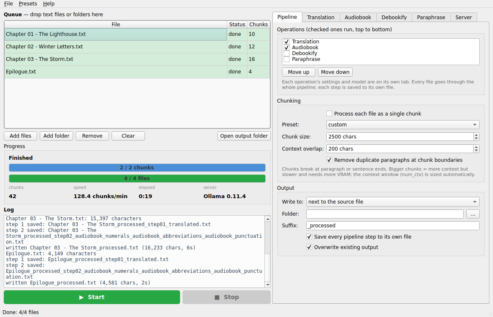

# ollama-batch-processor

Run whole books through a **local LLM** with [Ollama](https://ollama.com): translate, prepare text for audiobook
narration, strip book formatting, or paraphrase — chunk by chunk, file after file, with every step saved.



## What it does

- **Queue** any number of `.txt` / `.md` / `.srt` / … files (or folders), press *Start*, get `name_processed.txt`
  next to each source (or in a folder of your choice).
- **Pipeline** of operations, run top to bottom — each with its own model and settings:

  | Operation | |
  |---|---|
  | **Translation** | any language pair, meaning-first prompts with idiom handling; the end of the previous *translation* is fed back as context so names, terminology and register stay consistent across chunks |
  | **Audiobook** | spell out numbers, expand abbreviations, normalise punctuation for speech pacing, remove visual-only formatting |
  | **Debookify** | remove footnotes / page numbers / indexes, running headers & footers, normalise chapter headings |
  | **Paraphrase** | improve flow, simplify language, remove idioms, shift tone (formal / casual / professional / conversational) |

  All checked tasks of one operation are merged into a **single prompt**, so the text passes through the model once per operation.
- **Smart chunking**: breaks at paragraph or sentence ends, configurable size / overlap or whole-file mode; the
  Ollama context window (`num_ctx`) is sized automatically from the chunk so nothing is silently truncated.
- **Progressive saving**: a `.partial` file grows chunk by chunk, each pipeline step is written to its own file,
  Stop keeps what is finished. Duplicate paragraphs at chunk seams are removed.
- **Robust output**: `<think>…</think>` blocks of reasoning models, "Here is the translation:" preambles, wrapping
  quotes / code fences are stripped; a warning is logged when a chunk's output length is suspicious.
- **Server panel**: URL, connection test, model list refresh, request timeout, keep-alive, `num_ctx` / `num_predict` / `top_p`.
- **Presets** (menu): Translate EN→CS / CS→EN, Audiobook preparation, Book cleanup, Plain language rewrite,
  Translate then audiobook — plus save / load / import / export your own and *save as defaults*.
- Prompts and operations live in **`config.json`** next to the app (*File → Edit operations / prompts*): add your own
  operation with options and a prompt and it shows up as a tab.

## Install

Grab a prebuilt binary from the [latest release](https://github.com/hclivess/ollama-batch-processor/releases/latest)
(Windows / Linux / macOS, no Python needed), or run from source:

```
pip install -r requirements.txt
python main.py            # run.cmd / run.sh do the same
```

You need a running Ollama with at least one model:

```
ollama serve
ollama pull qwen2.5:14b   # or llama3.1, aya-expanse (great for translation), gemma3 ...
```

The server can be on another machine — put its URL in the *Server* tab.

## Tips

- **Translation**: temperature 0.2–0.4, chunks of 2000–3000 chars, overlap 200. Bigger models translate
  noticeably better; `aya-expanse` and `qwen2.5` are strong for European languages.
- **Cleanup tasks** (audiobook / debookify): temperature 0.0–0.2, larger chunks (3000–4000), overlap 0.
- **Slow CPU models**: set the request timeout to `none` in the *Server* tab.
- **Out of memory**: reduce the chunk size (this shrinks `num_ctx`) or set `num_ctx` manually.
- Output is `<name>_processed.txt`, steps are `<name>_processed_step01_translated.txt` etc.; existing files are
  skipped unless *Overwrite* is on.

## Build

`pip install -r requirements.txt pyinstaller && python build.py` produces `dist/ollama-batch-processor-<version>-<os>-<arch>`.
The GitHub workflow builds all three platforms on every tag and attaches them to the release; the Linux job installs
Ollama, pulls `qwen2.5:0.5b` and runs a real translation through the frozen build
(`OLLAMA_BATCH_SELFTEST=<text file>`).

## Changes in 2.0

- New GUI in the [whisperer](https://github.com/hclivess/whisperer) style: queue with per-file status, live chunk
  progress and speed, log, presets menu, Server tab with connection test and model refresh
- Streaming requests in a worker thread (no more qasync / aiohttp); **Stop** really stops, mid-chunk
- Fixed: temperature was ignored for translation and passed raw (3.0 / 5.0!) to the other operations; `config.json`
  and the stylesheet were loaded from the current directory (broke when started from elsewhere); errors were written
  into the output as `[ERROR: …]` placeholders; the batch continued after Stop; output naming broke for non-`.txt` files;
  no `num_ctx` was set, so long chunks were truncated by Ollama's default 2k context
- Automatic context-window sizing and an automatic answer-token cap (a looping model can no longer run forever), keep-alive, timeout, `<think>` stripping, wrapper/prefix cleanup, length sanity check
- Translation continuation uses the previous translation (not the source) as context; chunk boundaries prefer
  paragraph breaks; duplicate removal only affects substantial repeats
- Input encoding detection (UTF-8 with BOM, UTF-16, cp1250/cp1252 fallback), overwrite guard, `.partial` progress file
- Standalone builds for Windows / Linux / macOS via PyInstaller + GitHub Actions
